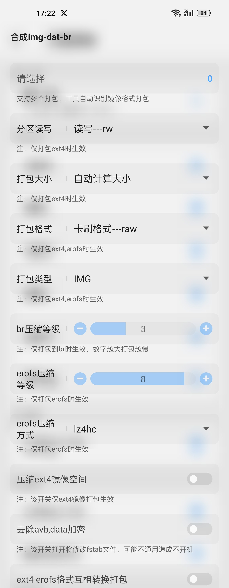

# 安卓刷机理论部分
## 磁盘文件分区表
>	类似于mount后输出的内容,是又不完全是.  
>	因为mount是***已经挂载的文件系统列表***.  
>[相关链接](https://www.cnblogs.com/wkfvawl/p/11687619.html)**Java版**    ~~可能是分区管理？~~.  
>[修补链接](https://zhuanlan.zhihu.com/p/370552513#:~:text=硬盘分区表格式GUID和MBR知识普及%201%201.%20MBR分区表：Master%20Boot%20Record，即硬盘主引导记录分区表，只支持容量在%202.1TB,以下的硬盘，超过2.1TB的硬盘只能管理2.1TB，最多只支持4个主分区或三个主分区和一个扩展分区，扩展分区下可以有多个逻辑分区%E3%80%82%202%202.%20GPT分区表：GPT，全局唯一标识分区表%20%28GUID%20Partition%20Table%29，与MBR最大4个分区表项的限制相比，GPT对分区数量没有限制，但Windows最大仅支持128个GPT分区，GPT可管理硬盘大小达到了18EB%E3%80%82%20只有基于UEFI平台的主板才支持GPT分区引导启动%E3%80%82)**类原生**    ~~是真正的分区表~~.
- 分区表是磁盘上的一张表，汇总描述了分区的大小和位置。它位于硬盘的首扇区(0柱面，0磁头，1扇区，MBR)
- 分区表一般有两种存储分区信息的方案，传统的MBR（Master Boot Record）分区表和GPT（GUID Partition Table）分区表，包括分区在物理磁盘上的起止位置
- 通过分区表允许你的操作系统知道哪些扇区属于哪个分区以及哪个分区是可引导的
- **MBR分区表：Master Boot Record，即硬盘主引导记录分区表，只支持容量在 2.1TB 以下的硬盘，超过2.1TB的硬盘只能管理2.1TB，最多只支持4个主分区或三个主分区和一个扩展分区，扩展分区下可以有多个逻辑分区**
- **GPT分区表：GPT，全局唯一标识分区表(GUID Partition Table)，与MBR最大4个分区表项的限制相比，GPT对分区数量没有限制，但Windows最大仅支持128个GPT分区，GPT可管理硬盘大小达到了18EB。只有基于UEFI平台的主板才支持GPT分区引导启动**
## 磁盘文件分区类型(~~分区格式~~)
1. FAT
		`最初是为软盘设计的文件系统`.
		**为什么只能存储4GB**：FAT文件系统使用32位文件大小字段来记录文件的大小，这意味着文件大小的最大限制为2^32-1个字节，约为4G`
1. ExtFAT
		`它是专门为闪存盘设计的文件系统，单个文件突破了4G的限制，而且分区的最大容量可达64ZB，建议512TB`
1. ext2
		`ext2是为解决ext文件系统的缺陷而设计的可扩展的、高性能的文件系统，又被称为二级扩展文件系统。它是Linux文件系统中使用最多的类型，并且在速度和CPU利用率上较为突出。ext2存取文件的性能极好，并可以支持256字节的长文件名，是GNU/Linux系统中标准的文件系统`
4. ext3
		`ext3是ext2文件系统的日志版本，它在ext2文件系统中增加了日志的功能。ext3提供了3种日志模式：日志（journal）、顺序（ordered）和回写（writeback）。与ext2相比，ext3提供了更好的安全性以及向上向下的兼容性能`
5. ext4
	1. 与 Ext3 兼容：执行若干条命令，能从 Ext3 在线迁移到Ext4，而无须重新格式化磁盘或重新安装系统
	2. 更大的文件系统和更大的文件。较之 Ext3 目前所支持的最大 16TB 文件系统和最大 2TB 文件，Ext4分别支持 1EB（1,048,576TB， 1EB=1024PB， 1PB=1024TB）的文件系统，以及 16TB 的文件
	3. 无限数量的子目录。Ext3 目前只支持 32,000 个子目录，而Ext4支持无限数量的子目录
	4. Ext4引入了现代文件系统中流行的 extents 概念，每个 extent 为一组连续的数据块，上述文件则表示为“该文件数据保存在接下来的 25,600 个数据块中”，提高了不少效率
	5. 当写入数据到 Ext3 文件系统中时，Ext3 的数据块分配器每次只能分配一个 4KB 的块，写一个 100MB 文件就要调用 25,600 次数据块分配器，而Ext4的多块分配器“multiblock allocator”（mballoc） 支持一次调用分配多个数据块
	6. Ext4和其它现代文件操作系统的策略是尽可能地延迟分配，直到文件在 cache 中写完才开始分配数据块并写入磁盘，这样就能优化整个文件的数据块分配，与前两种特性搭配起来可以显著提升性能
	7. 快速 fsck。以前执行 fsck 第一步就会很慢，因为它要检查所有的 inode，现在Ext4给每个组的 inode 表中都添加了一份未使用 inode 的列表，今后 fsck Ext4 文件系统就可以跳过它们而只去检查那些在用的 inode 了
6. APFS
	- APFS为苹果Darwin内核专用的一个文件系统，有大量现代化的功能，本文不做详细解读
7. EROFS
	>增强型只读文件系统 Enhanced Read-Only File System
	>那么，既然只读，那为什么可以做成文件系统呢？(以下纯属理论+推测)：  
		这是因为，开发者将预开发(设计)好的文件系统(文件夹)(**此时是可读写的！**)使用命令打包成了一个镜像文件"xxxx.img"(**此时已经不可读了**)  
		而这个镜像文件是一个被打包成二进制的文件(但是没有被压缩)，仅包含了文件系统格式和文件内容  
		当需要使用这个文件系统镜像时，只需要将文件系统镜像mount到一个位置即可自动显示出原文件，然而这时候原文件系统已经被转换为erofs只读文件系统，无论你怎么挂载依然是只读
		

	  1. EROFS由华为引出，目的是使文件系统不可读，但是运行效率提升
	  2. EROFS着重优化了运行时性能，同时实现了存储空间节省
	  3. EROFS针对Android、HarmonyOS智能手机或嵌入式设备等硬件资源有限的设备上的高性能只读需求，提供了透明压缩节省存储空间的解决方案。
	  4. EROFS为Linux内核开发的轻量级只读文件系统，旨在为各种只读使用场景（嵌入式设备、容器等）提供只读文件系统解决方案
8. F2FS
>Flash-Friendly File System

	F2FS相比于ext有什么优势和不同点？：
		1.F2FS相比于Ext更能保护磁盘和提升磁盘的读写速度
		2.Ext作为Linux使用最广泛的文件格式，相比较F2FS有更好的稳定性
		3.F2FS是下一代的文件系统格式，对固态硬盘和闪存设备有较好的亲和力
	
## super分区是什么?
>	super分区原理如下:
>		因为若存在(system|vendor|cust|product)分区,每次系统更新时,这些分区表都需要进行动态更新，会频造成繁擦写以及造成麻烦
>		与其这么麻烦地擦写，还不如直接mkdir一个文件夹(30GB(当然这是我瞎写的))这样就可以在有限的空间内随意排版，动态更新信息，而不用一直在外部分区表中动态更新这些分区，岂不美哉？
>		故，super分区称为：动态分区


	
## /etc/fstab文件的作用
>	fstab用于提前挂载磁盘，且指定了磁盘的分区格式和挂载点
>	然鹅现在的fstab表一般存在于boot.img中，需要自行分解
## 纯A分区｜A/B分区｜V A/B分区的概念
1. 纯A分区：
	>	包含了recovery和system分区，未对system、cust、vendor分区做Super大分区
2. 纯A动态分区：
	>	包含了recovery分区，但是对系统的system、cust、vendor分区做了Super大分区
3. 纯A/B分区：
	>	**A/B分区会将Recovery整合进Boot分区！**
	>	将系统分成了两个部分，A槽和B槽
	>	
	>	不使用B槽(B槽没系统)的时候，B槽为空。而一旦OTA或者动态升级的时候，用户空间A槽得以保留，并可以继续使用，OTA时会将新系统自动写入B槽，只需用户重启后即可切换到新系统B槽中
	>	
	>	而且即使B槽更新失败了，也可以直接通过退回A槽保持原系统，而不会丢失数据
	>	
	>	纯A/B分区不会将system、cust、vendor分区做Super大分区
4. 动态A/B分区：
>	字面意思
5. V A/B分区
>	**不可刷入不确定的DSU！！！
>	Virtual(虚拟) A/B分区，简称VA/B分区，结合了纯A和动态A/B的所有缺点于一身**
>	VA/B原理如下：
>		1.逻辑分区(system、vendor)虚拟出了一个B槽，但是**并未实体挂载**，而是虚拟了一个镜像位出来
>		2.当用户在进行OTA更新时，会将新下载的逻辑分区变成虚拟分区B槽。待重启后，将B槽的名称重命名为A槽，并将A槽删除
>		
>	VA/B分区和A/B分区都没有recovery，那如何进入呢：
>		答案就在VA/B分区和A/B分区的Boot.img里
>		直接使用`fastboot boot recovery.img`即可进入recovery，再在recovery里刷入TWRP即可替换原生recovery
>		绝对不可直接刷入`fastboot flash boot recovery.img`
>		绝对不可直接刷入`fastboot flash boot recovery.img`
>		绝对不可直接刷入`fastboot flash boot recovery.img`
>		


## RamDisk是什么？：
>Ram Disk简写就为RamDisk，就是内存虚拟磁盘  
>相较于实体硬盘，RamDisk处理速度更快以及相同时间内更多读写(下面开始胡说Time)  
>>Android启动时也运用了Ramdisk技术(boot分区)：
>>	boot里首先存放着Ramdisk(不知道该称为文件还是文件夹)文件夹，里面存放着根目录的雏形，并有很多开机时刻需要运行/加载的文件
>>	当Ramdisk挂载进"/"后，执行Ramdisk中的加载文件
>>>	现在有两种说法，观众老爷自行选择合适的听取就好：
>>>	1.加载文件的时，所有操作都在Ramdisk中执行，rootfs是基于内存的文件系统，所有操作都在内存中完成，也没有实际的存储设备，所以不需要设备驱动程序的参与  
>>>	基于以上原因，linux在启动阶段使用rootfs文件系统，当磁盘驱动程序和磁盘文件系统成功加载后，linux系统会将系统根目录从rootfs切换到磁盘文件系统
>>>	2.加载文件时，在“/”中执行完初始化操作后，挂载了所有的系统分区，并使用chroot将根目录给了system，系统启动完成
>
>>然而当系统真正装载时，却会释放掉这些虚拟的内存磁盘，将系统实装  
>>故，Ramdisk显著提高了启动速度(抱有怀疑态度)
>
>***Ram Disk的反义词是`SWAP`***

## System As ROOT：
	System As Root简称为"SAR",就是将system分区充当"/"根目录
## RootFS：
	Root File System 根文件系统，简称RootFS
## AVB验证
- 针对不同分区委托更新、提供用于对分区进行签名的通用页脚格式，以及防止攻击者回滚到存在漏洞的 Android 版本
- 其验文件一般存在于`/vendor/etc/fstab.default || /system/vendor/etc/fstab.default`进去打开后即可看到vab的身影
-  如何禁止AVB验证?:
	进入bootloader，并使用原包里的`vbmeta.img`  
	加此代码刷入:  ```fastboot --disable-verity --disable-verification flash vbmeta /path/to/vendor.img```
## vendor_boot/Boot宽容：
>说起vendor_boot宽容，那就不得不提起SELinux了👉🏻[传送门](https://blog.csdn.net/yanjun821126/article/details/80828908)  
>了解了SELinux，发现SELinux其实就是有三种工作模式：
1. enforcing：强制模式。违反 SELinux 规则的行为将被阻止并记录到日志中  (后文中的命令为"1")  
2. permissive：宽容模式。违反 SELinux 规则的行为只会记录到日志中。一般为调试用  (后文中的命令为"0")  
3. disabled：关闭 SELinux    
```
宽容SELinux:
	前提条件:获取了Root Shell权限
	解除代码:{
		adb状态下:adb shell
		shell状态下:su setenforce 0
	}
强制SELinux:
	前提条件:获取了Root Shell权限
	强制代码:{
		adb状态下:adb shell
		shell状态下:su setenforce 1
	}
```
# 安卓刷机实战部分
## 软件介绍(~~其实前两个除了作者之外就没差~~)
1. DNA Android：
	- 是由酷安`Errors`和`tao1996`大佬联合制作
	- 支持三端操作(Android,Linux,Windows)
	- 老牌的安卓镜像重构软件，支持的功能更完善
 	- [tao1996大佬酷安主页](http://www.coolapk.com/u/1128537)
	- [Errors大佬酷安主页](http://www.coolapk.com/u/1403335)
	- [D.N.A项目GitLab直达链接](https://gitee.com/sharpeter/DNA)
	- [D.N.A Android项目酷安直达链接](https://www.coolapk.com/feed/38568666?shareKey=NjUwNWJjYTQ2MTFjNjVkZDVjOWE~&shareUid=19405669&shareFrom=com.coolapk.market_14.0.2)
3. Mio Kitchen:
	- 是由[`寒风居士`](https://github.com/ColdWindSchola)创作的软件
	- 支持四端操作(Android,Linux,Windows,macOS)
	- 新兴的安卓镜像重构软件，支持分区互转
	- [作者项目直达链接](https://github.com/ColdWindScholar/MIO-KITCHEN-SOURCE)
  	- [作者酷安直达](http://www.coolapk.com/u/11495164)
4. TIK:
	- 是由[`寒风居士`](https://github.com/ColdWindSchola)和`yeliqin`联合制作
	- 老牌ROM工具，知名度不是很高， 但是非常稳定
	- 支持四端操作(Android,Linux,Windows,macOS)
	- 最新的版本基于MIO-KITCHEN底层
	- [作者项目直达链接](https://github.com/ColdWindScholar/TIK)
5. MT Manager(MT管理器):
	- [项目直达链接](https://mt2.cn)
	- 老牌的Android文件管理软件，听过这个文件管理器的都上了年纪了
	- 横向支持的安卓系统跨度大
	- 内置很多非常实用的功能，包括但不限于
>apk逆向、双行文件比对、一键解压缩、代码支持完善、内置终端、可直接运行sh文件、支持安装卸载提取apk、支持安装apkx

## 净化OEM包
>除了手机里的：安全管家、软件包安装组件，之外的软件都可以移除  
>安全管家需要手机root后再架空APK中的`.dex`文件，使用核心破解安装
- 小米：抹除`cust`分区和解包净化`procduct`分区即可
	- `cust`需要在`bootloader`中刷写
	- `product`需要在`fastbootd`中刷写
- OPPO/一加：需要净化`my_[a-zA-Z]+`分区的大部分，以及`system_ext`的局部
	- `my_[a-zA-Z]+`分区和`system_ext`分区都需要在`fastbootd`中刷写
	- 建议root后的第一件事就是备份`super`分区
## 解锁 System根目录可读写权限
1. 首先确定你的手机根目录分区格式，这里推荐使用`设备信息.apk`
	>下载直达链接👉🏻：[设备信息](https://apkpure.net/cn/device-info-one-application-all-information/com.liuzh.deviceinfo)
	>这边使用了 [APKPure](https://apkpure.net) 的链接，  
	>有介意的小伙伴可自寻其它途径下载安装
2. 下载并打开`设备信息`，找到储存选项卡
3. 点击储存选项，查看系统储存这个选项
4. 查看系统储存的后面文件系统格式，并记录下来
> 若原生为`ext`文件系统，则只需去除avb验证就可以读写  
> 若原生为`erofs`文件系统，则需要转换`System.img`的镜像系统才可读写  
> 接下来以`Erofs`文件系统加`DNA`软件为例，其中包括了去除`AVB`验证
5. 首先，打开`DNA`软件，并提取`System.img`镜像备用
6. 创建一个工程，名字自己随意填写即可
7. 使用`MT管理器`，将`/sdcard/DNA/image`里的提取出的system.img移入`/sdcard/DNA/NA_Your_ProJect_Name`下
8. 打开`DNA`软件，进入工程菜单，选择`分解img`，点击并选择刚刚添加的`system.img`
>至于要不要选择`删除原文件`，看自己选择  
>老手或者有把握的建议直接无脑钩  
>新手或者怕第一次没把握的建议别勾，可以多操作几次  
9. 等待其分解结束后，可以进入mt管理器，并进入以下路径:
	>		/data/DNA/NA_Your_ProJect_Name/System
1. 在这个根目录下，可以创建一个文件夹(名字自己取，建议中文)，防止掉读写
2. 操作完成后，可以自行删除一些预装在system的文件以减少占用空间(比如miui会在system里留2-5个系统级预装软件(工具))
3. 去除系统级avb验证(可选)：
	1. 进入`/data/DNA/NA_Your_ProJect_Name/System/System/vendor/etc`  
	2. 找到`fstab.default`，点击并使用`编辑文本`打开它   
 
   3. 找到含有`avb=vbmeta_system`所有字样的段落 并将含有“`avb=vbmeta_system,`”的字段精确删除
	>记得一定一定一定要连后面的一个`“,”`也删了，否则会错误  
	>操作无误后保存好文件，并退出编辑
13. 将`/data/DNA/NA_Your_ProJect_Name/System`下的所有文件全选  
并长按任意一个文件  
选择属性，点击更多，选择文件权限，并按照图中的指示将权限赋予根目录
15. 返回DNA，进入`合成img-dat-br`选项  
第一项选择systen.img进行打包，后续的选项若无`特别需求`，就如图勾选即可
16. 打包好后，可以在`/sdcard/DNA/NA_Your_ProJect_Name/out`目录下找到你生成打包好的`system.img`
>执行下一步之前，请先确认你有系统卡刷包，并且拥有原版`vbmeta.img`
>若没有，则跟着教程操作提取一份`vbmeta.img`
17. 打开`DNA`软件，选择提取镜像文件，搜索并提取`vbmta.img`分区
	>	提取完`vbmeta.img`分区后，你可以在`/sdcard/DNA/image`里找到`vbmeta.img`  
	>	并将之前转换好的`System.img`和刚刚提取的`vbmeta.img`一并传入电脑，等待下一步的操作
18. 进入电脑`adb`中，输入:
	>		adb reboot bootloader
19. 进入`bootloader`后，输入这串命令，并将你提取的`vbmeta.img`拖入后面  
**这一步的作用是，禁用VAB验证，防止后续操作造成系统不开机**
	>		fastboot --disable-verity --disable-verification flash vbmeta 
20. 输入这串命令，使手机进入`fastbootd`模式：
	>		fastboot reboot fastboot
21. 进入`fastbootd`模式后，输入这串命令来刷写`System.img`  
并将你`提取并修改打包过的`   `system.img`拖入后面
	>		fastboot flash system 
22. 完成以上操作后，输入这串命令重启到主系统：
	>		fastboot reboot
23. 尝试用mt管理器在根目录`“/”`下创建一个文件，并开始体验根目录可读写的体验吧！
